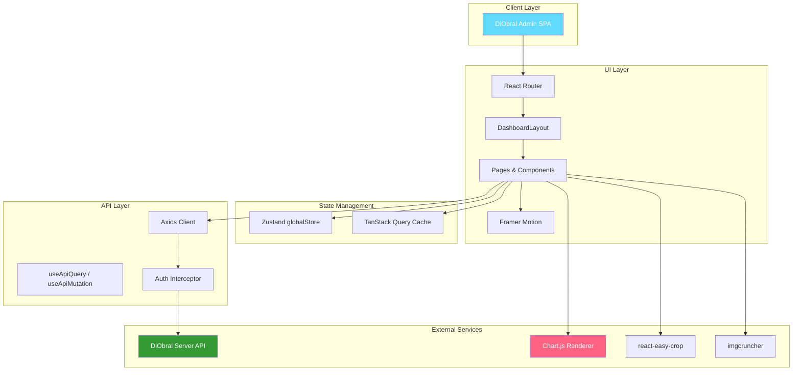
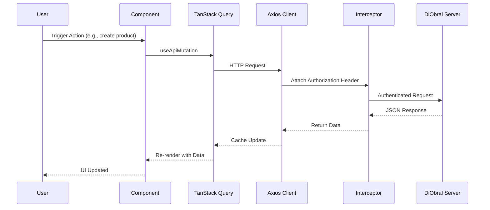
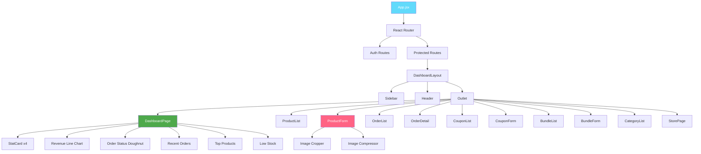

# DiObral Admin

[](package.json)
[](LICENSE)
[](#contributing)
[](#)

---

**Author:** [**Bazil Suhail**](https://github.com/BazilSuhail/)

---

## What is DiObral Admin?

**DiObral Admin** is the retailer-facing admin dashboard for the DiObral Online Marketplace. It provides a comprehensive management interface where retailers oversee products, orders, coupons, bundles, categories, and store settings — all backed by real-time analytics and chart-driven insights.

> **DiObral** = *Digital* + *Obral* (Indonesian for "wholesale/market") — a digital marketplace built for scale, speed, and intelligent operations.

> ### Mermaid Diagrams
> Head straight to the **[Architecture & Flows →](#mermaid-diagrams)** section at the very end of this README,
> or [click here to jump to the diagrams](#mermaid-diagrams).

---

## The Stack

[](https://react.dev/)
[](https://vitejs.dev/)
[](https://tailwindcss.com/)
[](https://reactrouter.com/)
[](https://tanstack.com/query)
[](https://zustand-demo.pmnd.rs/)
[](https://motion.dev/)
[](https://www.chartjs.org/)
[](https://axios-http.com/)
[](https://react-icons.github.io/react-icons/)

---

## Features

### Dashboard & Analytics

| Feature | Description |
|---------|-------------|
| **Overview Stats** | Product count, pending orders, 30-day revenue, average rating |
| **Revenue Trend** | Line chart showing revenue trends over the last 30 days |
| **Order Status** | Doughnut chart breaking down orders by status (pending, processing, shipped, delivered, cancelled) |
| **Recent Orders** | Live list of the 5 most recent orders with customer name, date, total, and status |
| **Top Products** | Best-performing products ranked by quantity sold and revenue |
| **Low Stock Alerts** | Real-time list of products with critically low stock levels |

### Product Management

| Feature | Description |
|---------|-------------|
| **Product List** | Grid view of all products with search, stats (total, active, inactive, low stock, on sale, inventory value) |
| **Add Product** | Create new products with image uploads, descriptions, pricing, stock, sizes, and categories |
| **Edit Product** | Update existing product details, stock levels, and attributes |
| **Delete Product** | Remove products with confirmation |
| **Image Handling** | Image cropping via `react-easy-crop` and compression via `imgcruncher` |

### Order Management

| Feature | Description |
|---------|-------------|
| **Order List** | All orders with status filtering (pending, processing, shipped, delivered, cancelled) |
| **Order Detail** | Detailed view of individual orders with items, shipping address, and status |
| **Status Updates** | Update order fulfillment status |
| **Order Stats** | Total revenue, pending count, delivered count |

### Coupon Management

| Feature | Description |
|---------|-------------|
| **Coupon List** | All coupons with stats (total, active, expired, exhausted, percentage vs fixed) |
| **Create Coupon** | Add new discount coupons with type, value, min purchase, max discount, usage limits |
| **Edit Coupon** | Update coupon details and settings |
| **Delete Coupon** | Remove coupons with confirmation |

### Bundle Management

| Feature | Description |
|---------|-------------|
| **Bundle List** | All bundles with stats (total, active, inactive, expired, scheduled, total items) |
| **Create Bundle** | Create product bundles with images, pricing, and product selection |
| **Edit Bundle** | Update bundle details and products |
| **Delete Bundle** | Remove bundles with confirmation |

### Category Management

| Feature | Description |
|---------|-------------|
| **Hierarchical Categories** | Parent/child category tree with expand/collapse |
| **Add Category** | Create new categories with name, description, and thumbnail |
| **Edit Category** | Modify category details and hierarchy |
| **Delete Category** | Remove categories with optional product reassignment |
| **Search Filtering** | Filter categories by name in real time |

### Store Management

| Feature | Description |
|---------|-------------|
| **Store Profile** | Update store name, description, contact info, policies |
| **Store Settings** | Manage return policy, shipping info, social links |
| **Profile Settings** | Update retailer name, email, and password |

### Authentication

| Feature | Description |
|---------|-------------|
| **Login** | Secure JWT-based authentication |
| **Register** | New retailer account creation |
| **Protected Routes** | Dashboard routes guarded by authentication state |
| **Auto Logout** | Automatic logout on 401 responses |

---

## Installation

```bash
# Clone the repository
git clone https://github.com/BazilSuhail/DiObral-Admin.git
cd DiObral-Admin

# Install dependencies
bun install
```

### Prerequisites

| Tool | Version |
|------|---------|
| **Node.js** | Latest LTS |
| **Bun** | 1.3+ |
| **DiObral Server** | Running at `http://localhost:5000` |

---

## Getting Started

### 1. Configure environment

```bash
cp .env.example .env
# Edit .env with your API base URL
```

```env
VITE_API_BASE_URL=http://localhost:5000
```

### 2. Run the development server

```bash
bun run dev
```

Open [http://localhost:3000](http://localhost:3000) to view it in your browser.

---

## Tech Stack

| Technology | Purpose | Version |
|------------|---------|---------|
| **React** | UI Library | 19.3.0 |
| **Vite** | Build Tool & Dev Server | 6.4.3 |
| **Tailwind CSS** | Utility-First Styling | 4.3.3 |
| **React Router** | Client-Side Routing | 6.30.6 |
| **TanStack Query** | Data Fetching & Caching | 5.104.1 |
| **Zustand** | State Management | 5.0.15 |
| **Motion** | Animation Library | 12.43.0 |
| **Chart.js** | Charting Library | 4.5.1 |
| **react-chartjs-2** | Chart.js React Wrapper | 5.3.1 |
| **Axios** | HTTP Client | 1.20.0 |
| **React Icons** | Icon Library | 5.7.0 |
| **react-easy-crop** | Image Cropping | 6.2.3 |
| **imgcruncher** | Image Compression | 1.0.6 |
| **PostCSS** | CSS Processing | 8.5.28 |
| **Autoprefixer** | CSS Vendor Prefixes | 10.6.1 |

---

## Functionalities

### 1. Dashboard & Analytics

- **Stat Cards**: Products, pending orders, 30-day revenue, average rating with trend indicators
- **Revenue Trend Chart**: Line chart with gradient fill showing revenue over 30 days
- **Order Status Doughnut**: Visual breakdown of orders by status with color-coded segments
- **Recent Orders**: Last 5 orders with customer name, date, amount, and status pill
- **Top Products**: Best sellers ranked by units sold and revenue generated
- **Low Stock Alerts**: Products with stock ≤ 5 units highlighted for restocking

### 2. Product Management

- **Product List**: Searchable table/grid of all products with key metrics
- **Product Form**: Create/edit products with image upload, crop, compress, description, pricing, stock, sizes, categories
- **Image Pipeline**: Upload → Crop (`react-easy-crop`) → Compress (`imgcruncher`) → Store
- **Product Stats**: Total, active, inactive, low stock, on sale, inventory value

### 3. Order Management

- **Order List**: Filterable list of all orders by status
- **Order Detail**: Full order view with items, shipping address, totals, status history
- **Status Workflow**: pending → processing → shipped → delivered / cancelled
- **Order Stats**: Total revenue, pending count, delivered count

### 4. Coupon Management

- **Coupon List**: All coupons with usage stats and type breakdown
- **Coupon Form**: Create/edit coupons with code, type (percentage/fixed), value, min purchase, max discount, usage limits
- **Coupon Stats**: Total, active, expired, exhausted, percentage vs fixed counts

### 5. Bundle Management

- **Bundle List**: All bundles with product count and pricing info
- **Bundle Form**: Create/edit bundles with image, name, description, products, pricing
- **Bundle Stats**: Total, active, inactive, expired, scheduled, total items

### 6. Category Management

- **Category Tree**: Hierarchical parent/child category structure with expand/collapse
- **Category Form**: Add/edit categories with name, description, thumbnail, parent selection
- **Search**: Real-time category search with flattened results
- **Category Stats**: Total categories, subcategories, products per category

### 7. Store Management

- **Store Profile**: Update store name, description, contact email, phone, address
- **Store Policies**: Manage return policy and shipping information
- **Social Links**: Instagram, Facebook, website URLs
- **Profile Settings**: Update retailer full name, email, password

---

## How It Works

### Routing

```
/login → LoginPage
/register → RegisterPage
/ → Dashboard
/products → Product List
/products/new → Create Product
/products/:id/edit → Edit Product
/orders → Order List
/orders/:id → Order Detail
/coupons → Coupon List
/coupons/new → Create Coupon
/coupons/:id/edit → Edit Coupon
/bundles → Bundle List
/bundles/new → Create Bundle
/bundles/:id/edit → Edit Bundle
/categories → Category Management
/store → Store & Profile Settings
```

### Authentication Flow

1. **Login**: User submits credentials → `POST /auth/login` → JWT returned
2. **Token Storage**: JWT stored in Zustand persist (`diobral-admin-storage`)
3. **API Requests**: Axios interceptor attaches `Authorization: Bearer <token>`
4. **Protected Routes**: `ProtectedRoute` component checks `isAuthenticated`
5. **Auto Logout**: 401 responses trigger `logout()` and redirect to `/login`

### Data Fetching

- **TanStack Query**: Centralized caching, background refetching, stale-while-revalidate
- **useApiQuery**: Custom hook wrapping `useQuery` with consistent error handling
- **useApiMutation**: Custom hook wrapping `useMutation` with automatic cache invalidation
- **Axios Interceptors**: Request/response interceptors for auth and logging

### State Management

- **Zustand**: Single `globalStore` for auth, user, and sidebar state
- **Persistence**: Auth state persisted to `localStorage`
- **Sidebar**: Collapsible sidebar with pin state for desktop, drawer for mobile

---

## Pages & Routes

| Route | Page | Description |
|-------|------|-------------|
| `/login` | LoginPage | Retailer login |
| `/register` | RegisterPage | Retailer registration |
| `/` | DashboardPage | Analytics overview with charts |
| `/products` | ProductList | Product management |
| `/products/new` | ProductForm | Create product |
| `/products/:id/edit` | ProductForm | Edit product |
| `/orders` | OrderList | Order management |
| `/orders/:id` | OrderDetail | Order detail view |
| `/coupons` | CouponList | Coupon management |
| `/coupons/new` | CouponForm | Create coupon |
| `/coupons/:id/edit` | CouponForm | Edit coupon |
| `/bundles` | BundleList | Bundle management |
| `/bundles/new` | BundleForm | Create bundle |
| `/bundles/:id/edit` | BundleForm | Edit bundle |
| `/categories` | CategoryList | Category hierarchy management |
| `/store` | StorePage | Store profile & settings |

---

## State Management

| Store | Purpose | Persistence |
|-------|---------|-------------|
| **globalStore** | Auth token, user profile, sidebar state | `localStorage` via Zustand persist |

---

## Project Structure

```
DiObral-Admin/
├── public/
│   └── placeholder.png
├── src/
│   ├── api/
│   │   ├── adapter.js          # useApiQuery / useApiMutation hooks (TanStack Query)
│   │   └── client.js           # Axios instance with auth interceptor
│   ├── components/
│   │   ├── bundles/            # Bundle form components
│   │   ├── categories/         # Category tree/form components
│   │   ├── layout/             # Sidebar, Header, DashboardLayout
│   │   ├── products/           # Product form components
│   │   └── shared/             # PageBanner, StatCard
│   ├── lib/
│   │   └── utils.js            # Utility functions
│   ├── pages/
│   │   ├── auth/               # LoginPage, RegisterPage
│   │   ├── bundles/            # BundleList, BundleForm
│   │   ├── categories/         # CategoryList
│   │   ├── coupons/            # CouponList, CouponForm
│   │   ├── dashboard/          # DashboardPage
│   │   ├── orders/             # OrderList, OrderDetail
│   │   ├── products/           # ProductList, ProductForm
│   │   └── store/              # StorePage
│   ├── store/
│   │   └── globalStore.js      # Zustand global state
│   ├── App.jsx                 # Root component with routes
│   ├── main.jsx                # Entry point
│   └── index.css               # Global styles
├── .env                        # Environment variables
├── .gitignore
├── index.html
├── package.json
├── README.md
├── vite.config.js
└── netlify.toml
```

---

## Contributing

Contributions are welcome! Open an issue or submit a pull request — by contributing, you agree to license your work under the same terms below.

---

## Author

**[Bazil Suhail](https://github.com/BazilSuhail/)** — [github.com/BazilSuhail](https://github.com/BazilSuhail/)

---

## License

This project is released under the **Bazil Suhail Hobby License v1.0** — see the [LICENSE](LICENSE) file for the full text.

| Allowed | Not Allowed |
|---------|-------------|
| Personal, hobby, learning & research use | Production deployment / serving real users |
| Copy, modify, and fork for non-commercial projects | Commercial, revenue-generating, or client work |
| Share publicly **with credit** to Bazil Suhail | Selling or reselling the Software as a product/service |

> **In short:** you are free to use DiObral Admin for fun, learning, and hobby projects — but **not in production or for profit** without prior written permission from **[Bazil Suhail](https://github.com/BazilSuhail/)**.

---

## Mermaid Diagrams

Jump back to the top: [Back to top](#diobral-admin)

### System Architecture



### Request Lifecycle



### Data Flow — Product Creation

```mermaid
flowchart LR
    A[Open Product Form] --> B[Fill Details]
    B --> C[Upload Image]
    C --> D[Crop Image]
    D --> E[Compress Image]
    E --> F[Submit Form]
    F --> G[POST /retailer/products]
    G --> H[Image Stored on Server]
    H --> I[Product Created]
    I --> J[Redirect to Product List]

    style A fill:#e1f5fe
    style I fill:#e8f5e9
    style J fill:#fff3e0
```



### Component Hierarchy



---

<p align="center">
  Built with <span style="color:#61DAFB">React</span> by the DiObral Team
</p>
